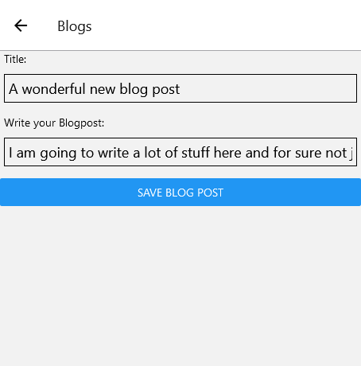
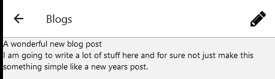
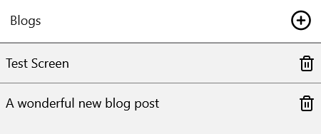

# Blog App
Another React Native run this time made an app that allows you to create, edit, and delete blog posts

You can create a new post

Read your post

View your current posts (and delete them)

# To run
Fairly normal stuff here,

`yarn`

Then just

`yarn start`